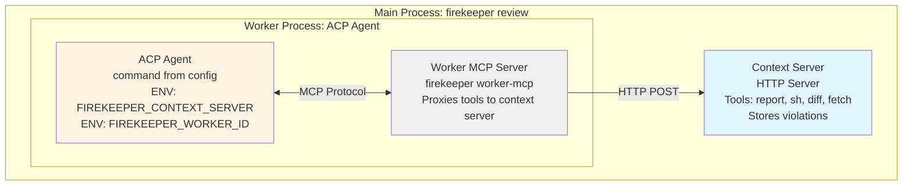

# ACP Agent Architecture

This document explains how ACP (Agent Client Protocol) agents work with Firekeeper's context server.

## Overview

When using ACP agents, Firekeeper spawns a local context server to provide review tools and context to external agent processes.

## Architecture



## Flow

1. **Main process** (`firekeeper review`) starts
2. If selected agent is ACP type, **context server** is spawned on `127.0.0.1:0` (random port)
3. For each review task, a **worker ACP agent** is spawned:
   - Command and args from config (e.g., `kiro-cli acp`)
   - Mode set via ACP session config (e.g., `firekeeper`)
   - Environment variables:
     - `FIREKEEPER_CONTEXT_SERVER`: Context server URL
     - `FIREKEEPER_WORKER_ID`: Unique worker identifier
4. ACP agent is configured to use **worker MCP server** (`firekeeper worker-mcp`)
5. Worker MCP server:
   - Inherits environment variables from ACP agent
   - Connects to context server via HTTP
   - Exposes tools: `report`, `sh`, `diff`, `fetch`
6. ACP agent calls tools through MCP, which proxy to context server
7. After completion, main process collects violations from context server

## Configuration

Example ACP agent config in `firekeeper.toml`:

```toml
[[agents]]
type = "acp"
name = "kiro"
command = "kiro-cli"
args = ["acp"]
mode = "firekeeper"
env = {}
```

## Tool Flow Example

When ACP agent calls the `report` tool:

1. Agent → Worker MCP: `report(violations)`
2. Worker MCP → Context Server: `POST /report/{worker_id}`
3. Context Server stores violations
4. Worker MCP → Agent: Success response
5. Main Process → Context Server: Retrieve violations after worker completes
